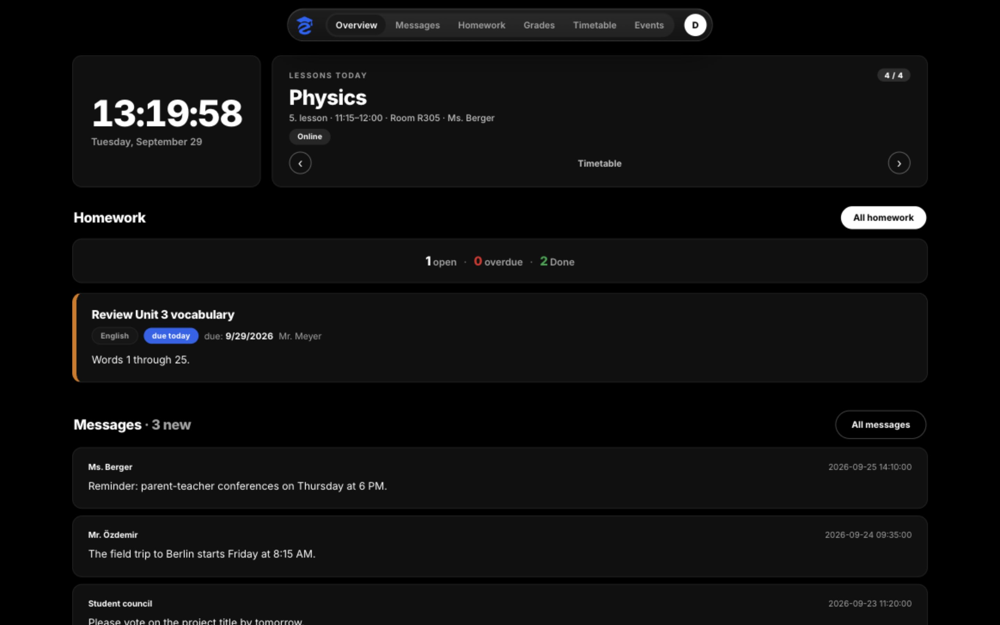
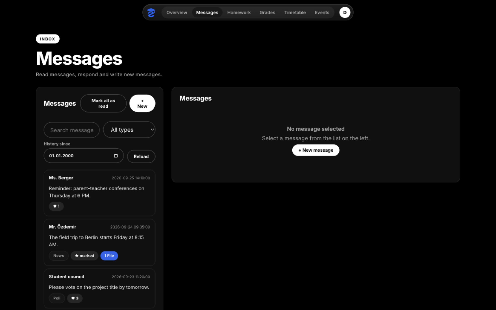
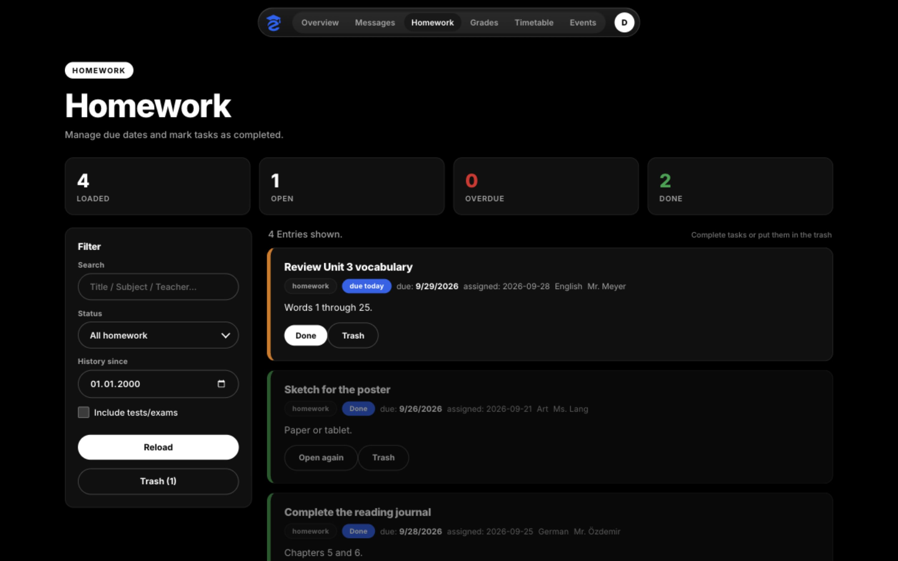
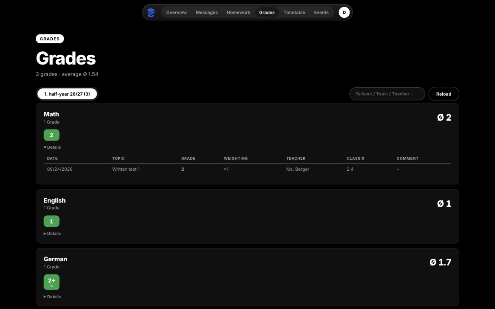
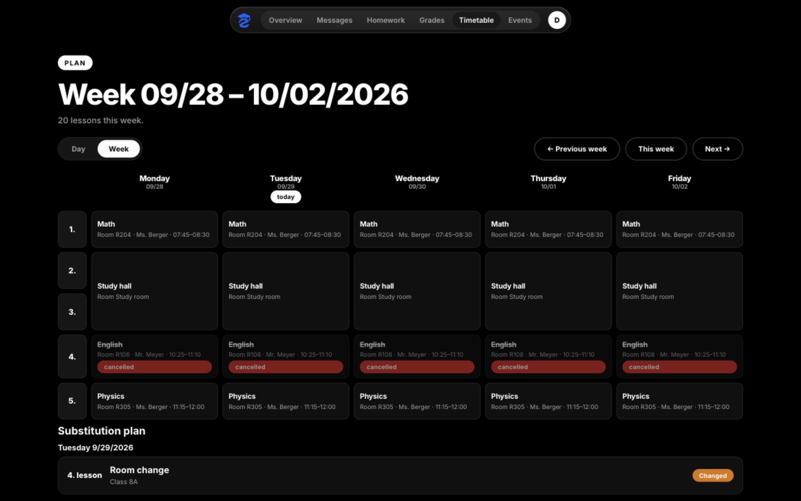
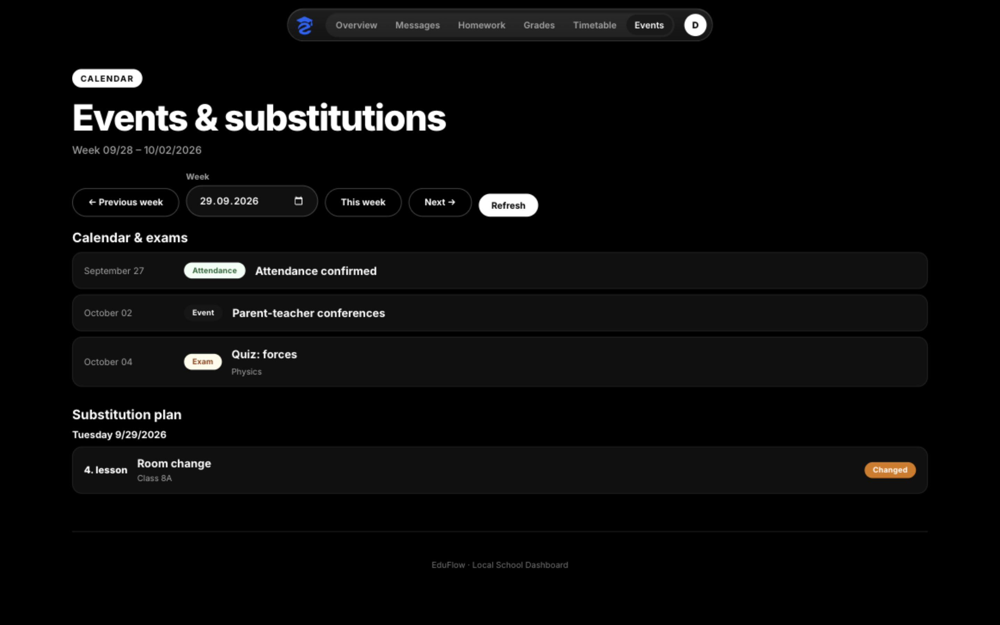
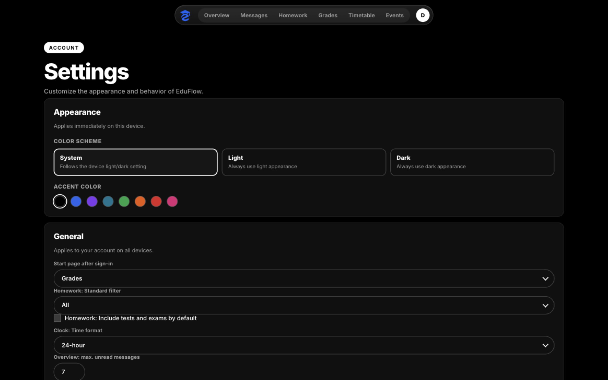

# Features

All pages share the top pill nav (Overview, Messages, Homework, Grades, Timetable, Events) and a profile menu (Settings, Sign out). Screenshots below show the English demo (`demo` / `demo`) with synthetic sample data.

## Overview (`/`)

Live clock, current/next lesson with room · teacher · time stepper, homework counts with open tasks, latest messages, and weather (hidden if disabled in settings). Column order is configurable in Settings.

## Messages (`/messages`)

Mail-style inbox: search, type filter (messages, news, polls, chats, announcements), history date, paging, mark-all-read, likes, replies, file downloads via short `dl` tokens, and compose with recipient search.

## Homework (`/homework`)

Stat cards (loaded/open/overdue/done), sidebar filter (search, status, history, include tests), per-task cards with due date, subject, teacher and actions (done, reopen, trash, restore), plus a trash view.

## Grades (`/grades`)

Header with count and weighted average, half-year tabs, subject search, per-subject cards with average and expandable details (date, topic, grade, weighting, teacher, class average).

## Timetable (`/timetable`)

Day/Week toggle, day navigation with lesson cards (time, title, teachers, room, cancelled/event/online tags), week matrix with today badge, and a substitution plan per change (lesson, title, class, cancelled/new/changed badge).

## Events & substitutions (`/agenda`)

Calendar, exam and attendance events plus the weekly substitution plan, with week navigation over a −30 d … +60 d window.

## Settings (`/settings`)

Appearance (system/light/dark + accent dots, this device), general account settings (overview order, weather city, homework defaults — saved to the server), sessions/devices, API token creation for other clients (30 days), and cache clearing (keeps settings).

