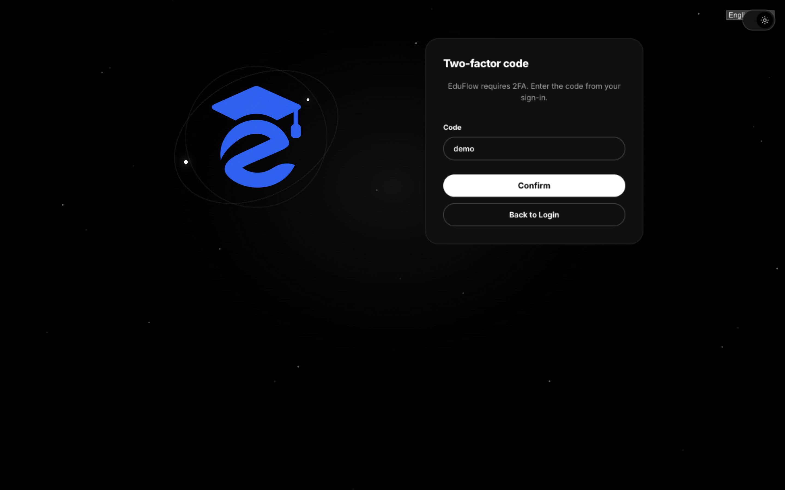

# Getting started

## Start the servers

```sh
# Real mode (EduPage login): API :3000 + Web :8000
./run.sh

# Demo mode (synthetic data): API :3100 + Web :8101
# Can run alongside real mode.
./run.sh --demo

# Detached (survives terminal close), stop with ./stop.sh
./run.sh --background
./run.sh --demo --background

# Custom ports
API_PORT=3001 WEB_PORT=8001 ./run.sh
```

`run.sh` checks tools and `node_modules`, verifies DB config, aborts on occupied ports, deploys Prisma migrations, starts the API (`nest start --watch`), waits up to 90 s for `GET /api/v1/health` to report `"status":"ok"`, then starts the web UI. `Ctrl+C` stops both in foreground mode.

## First login (demo)

1. Open `http://localhost:8101/`.
2. Sign in with `demo` / `demo` (subdomain is prefilled with `demo`).
3. To try two-factor auth: `demo-2fa` / `demo`, code `123456`.




## Verify

```sh
curl -s http://127.0.0.1:3100/api/v1/health   # {"status":"ok","version":"v1"}
npm run typecheck
npm test
```

## Real mode

Open `http://localhost:8000/` and sign in with your EduPage school subdomain, username and password. If the school requires 2FA, login returns `2fa_required` first — enter the code on the second screen. Sessions last 30 days (`Stay signed in`); any `401` sends you back to login.

## Native clients

- **Android** (emulator): default server `http://10.0.2.2:3000/api/v1/` (demo `:3100`), changeable in Login/Settings. On a physical device use `http://<host-LAN-IP>:3000/api/v1/`.
- **macOS**: default server `http://127.0.0.1:3000/api/v1/` (demo `:3100`), same machine.
