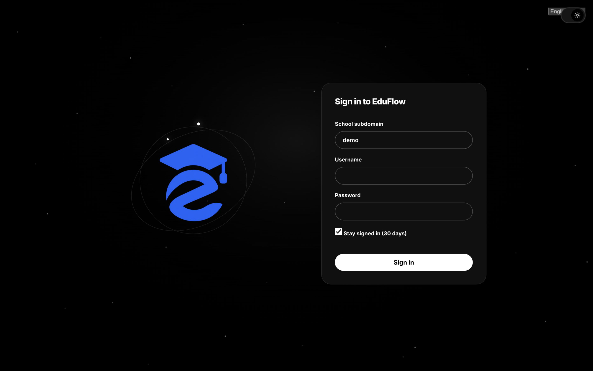

# EduFlow

EduFlow is a **local school dashboard**: a web app plus native clients (Android, macOS) backed by a local JSON API. It connects to [EduPage](https://www.edupage.org/) in real mode, or runs fully offline with synthetic demo data.

- **Web UI** (Next.js) + **API** (NestJS) on `/api/v1`
- **Native clients**: Android (Kotlin/Compose) and macOS (SwiftUI)
- **Two modes**: real (EduPage login) and demo (`demo` / `demo`, offline-safe)
- **Local-first**: the server is a tool on your own machine, not a hosted service. No push, no multi-user, no file uploads from apps.



## Where to go next

- [Installation](INSTALLATION.md) — prerequisites, `./install.sh`, ports
- [Getting started](GETTING_STARTED.md) — `./run.sh`, demo mode, first login, verification
- [Features](FEATURES.md) — what each page does, with screenshots
- [Architecture](ARCHITECTURE.md) — how API, web UI and clients fit together
- [API reference](API.md) — every `/api/v1` route, auth, errors
- [Platforms](PLATFORMS.md) — Android and macOS apps: build, run, test
- [Development](DEVELOPMENT.md) — checks, tests, conventions

## Modes at a glance

|  | Real | Demo |
|---|---|---|
| Start | `./run.sh` | `./run.sh --demo` |
| API | `http://127.0.0.1:3000/api/v1` | `http://127.0.0.1:3100/api/v1` |
| Web | `http://localhost:8000/` | `http://localhost:8101/` |
| Login | EduPage subdomain + username + password | `demo` / `demo` (2FA: `demo-2fa` / `demo`, code `123456`) |
| Data | Live EduPage session + Postgres cache | Synthetic fixtures, offline-safe |

Both modes can run side by side. On any `401` (`TOKEN_INVALID`, `TOKEN_EXPIRED`, `EDUPAGE_2FA`) clients return to login.

## Repository map

```
apps/api/     NestJS backend (TypeScript): /api/v1, edupage + fake providers
apps/web/     Next.js web UI (all pages, session proxy to the API)
packages/     Shared TypeScript contracts (@eduflow/contracts)
android/      Kotlin + Compose app
mac/          SwiftUI app (macOS 14+)
migration/    Installer helpers + notes
docs/         This documentation (GitBook)
```
